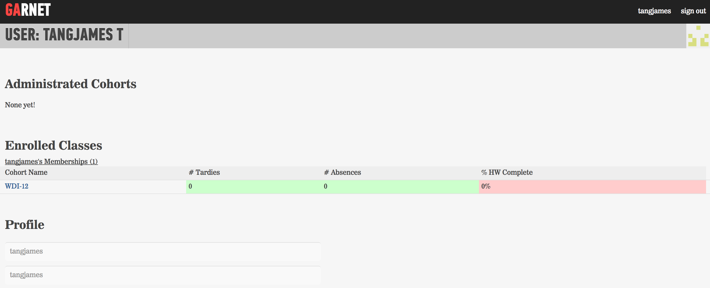
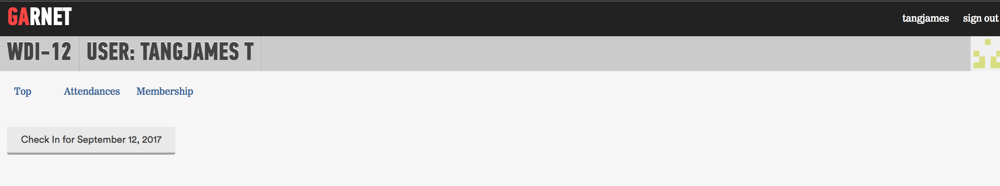

# Attendance

## Policy

- 3 late arrivals = 1 absence. 5 minutes late results in a tardy.
- Missing part of the day of class counts as ½ day absence
- Students can have no more than 3 absences
- If you are unable to avoid being late or need to request an absence: Let your instructors know via the private slack channel set up for you.

You will take your own attendance through Garnet while on the `WeWork` or `WWGuest` wifi network. Please check [the graduation requirements for arriving on-time](graduation-requirements.md)!

If class begins at 9:00AM, then any attendance taken at 9:01 will be considered "tardy". Attendance cannot be taken three hours after the start time. That is: if you try to take attendance at 12:01, you will be considered "absent".

## How to do it

1. Log into [Garnet](http://garnet.wdidc.org) and click the name of your current cohort located under "Enrolled Classes." In this case, that's "ATX-WDI-12". You will see something like this:

2. Click the grey button that says "Check In For *current date*" to mark yourself present for the day. This button will only be available for one hour after the beginning of the day. After that hour, you will be considered absent.

3. Once you have successfully checked in, you will see a success notification and have been marked present for the day!

