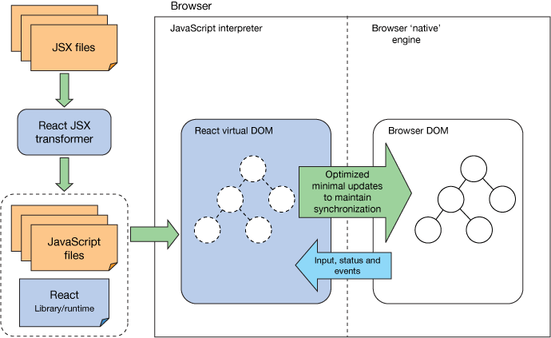

# React: Practice, Paradigms and Principles

## Learning Objectives

* Identify state in a React app
* Explain the properties and utility of components
* Distinguish container and presentational components
* Describe ways to add styles to a React app

## Framing

Today's lesson will revolve building an app called React TVMaze. This process will be broken up into multiple exercises. Prior to each exercise, we will either dive deeper into React concepts you have already learned or explore new ones.

But before we start coding, let's talk about the fundamental unit of any React app...

## [Components](https://facebook.github.io/react/docs/components-and-props.html)

Components let you split the UI into independent, reusable pieces, and think about each piece in isolation. Conceptually, components are like JavaScript functions. They accept arbitrary inputs (called "props") and return React elements describing what should appear on the screen.

In this class we'll look at building a React app that's more complex than the intro's blog example. When building an app like this, it's important to keep certain development practices and paradigms in mind so that we write maintainable code.

### [F.I.R.S.T. Components](https://addyosmani.com/first/)

A React component is built to expect an input and render a UI with it. More importantly, a well-structured component only receives data specific to its purpose. For example, our `Post` component from the blog example will only receive `title`, `author` and the like as inputs -- nothing else.

While this doesn't sound too groundbreaking, it is very different from the OOP principles we've gotten used to. This is because React follows a more **functional** approach to programming. For React components under this approach, **the same input will always produce the same output**.

You can build an app in a lot of ways, but if you want to look at some of the best practices, we can talk about what a component should be: **F.I.R.S.T.**

#### Focused

Components should do one thing and do it well. One thing that's hard to adjust to in React coming from an OOP background is packing too much information into a component.

> Think back to the Post component from the intro's class.

#### Independent

Components should increase cohesion and reduce coupling. Behavior in one component should not impact the behavior of another. In other words, components should not rely on one another.

> But they should compliment one another, just like our Comment component did for Post in the intro's class.

#### Reusable

Components should be written in a way that reduces the duplication of code.

> While the intro's Comment component was nested under a Post, we could have used it anywhere we wanted.

#### Small

Ideally, components should be short and condensed.

#### Testable

Because the same input will always produce the same output, components are easily unit testable.

> If you're interested, [Jest](https://facebook.github.io/jest/docs/tutorial-react.html) is a popular testing library for React.

## [State](https://facebook.github.io/react/docs/state-and-lifecycle.html)

So why do we follow all these principles? If not, it is easy to lose control of our application's state.

<details>
  <summary><strong>Q: What do we mean by a React component's "state"?</strong></summary>

  <br>

  > The properties of a component that change as the application runs. As opposed to .props, which are immutable.

</details>

<br>

So we've talked about `.state` at a more granular level. But now we're asking what it means for an application to have a singular "state" at a given point in time.

So what is this "state"? The organization and flow of data in an application at any point in time.

Let's think of states in terms of a game: Football.

<details>
  <summary><strong>Q: What can you say about the Cowboys when a new game starts?</strong></summary>

  <br>

  > 0 points. 0 touchdowns. 3 timeouts left.

</details>

<br>

<details>
  <summary><strong>Q: What about when the game ends?</strong></summary>

  <br>

  > 14 points. 2 touchdowns. 0 timeouts left. Cowboys win!

</details>

<br>

It's easy to think about this in terms of a game, because there is a clear idea of a beginning, end and states that reflect progress in between. You can attribute very specific data to all of these states.

<details>
  <summary><strong>Q: So we know an application can have different states. But how do we transition in between them?</strong></summary>

  <br>

  > Events.

</details>

<br>

You can think of your React application as a state machine. It receives user interaction as input and what we receive as output is a UI that reflects a brand new state.

Let's look at the process of a rendering a React Component...



## Exercise: React TVMaze

For this exercise, we are going to build a React app from scratch that will serve as a movie browser application, allowing users to enter a search term, and view results of tv shows via the TVMaze API.

The desired outcome is for you to take a look at the solution and from there devise your own implementation. We have also included a step-by-step walkthrough of how to build out the demoed solution below.

Go ahead and clone [React TVMaze](https://github.com/wdi-atx-12/react-tvmaze) now. This will be the code we start with.

```bash
$ git clone git@github.com:wdi-atx-12/react-tvmaze.git
$ cd react-tvmaze
$ npm install
$ npm run start
```

## [Start with a Mock](https://facebook.github.io/react/docs/thinking-in-react.html#start-with-a-mock)

First step in creating a React app is to start with a mock and some sample data.

### You Do: Identify Components

Look at this [deployed version of the application](http://react-tvmaze.surge.sh/) and answer the following questions...
- How many "views" does the application have?
- What components is this application comprised of?
- Which components belong to which views?

### Views

<details>
  <summary><strong>Open to see views and components...</strong></summary>

  <br>

  <h4>The Search View</h4>

  

  Here we've identified two components on the search page...
  1. The top level component, which we'll call `Home`, is boxed in magenta.
  2. The search input, a sub-component of `Home`, in yellow we'll call `Search`.

  <h4>The Results View</h4>

  

  Here we've identified three components on this page...
  1. The same `Home` top level component.
  2. A `results` components which contains results and an option to search again.
  3. The individual results

</details>

<br>

<details>
  <summary><strong>Open to see view-component hierarchy...</strong></summary>

  <br>

  <h4>Component Hierarchy</h4>

  Given these breakdowns we have a component hierarchy that looks like...

  - `Home`
    - `Search`
    - `Results`
      - `Result`

</details>

<br>

### Sample Data

The final application will use jQuery to communicate with the TVMaze API. To start with, however, we are going to feed the application some hard-coded data.

The below Javascript will go in our `index.js` file and will later be passed into our `Home` component as props...

```js
const results = [
  {
    "name":"The Office",
    "image":"http://static.tvmaze.com/uploads/images/medium_portrait/85/213184.jpg"
  },
  {
    "name":"Radiant Office",
    "image":"http://static.tvmaze.com/uploads/images/medium_portrait/101/254702.jpg"
  },
  {
    "name":"The Office",
    "image":"http://static.tvmaze.com/uploads/images/medium_portrait/93/234802.jpg"
  },
  {
    "name":"Mr. Box Office",
    "image":"http://static.tvmaze.com/uploads/images/medium_portrait/97/244942.jpg"
  },
  {
    "name":"The Queen of Office",
    "image":"http://static.tvmaze.com/uploads/images/medium_portrait/58/146476.jpg"
  },
  {
    "name":"No Offence",
    "image":"http://static.tvmaze.com/uploads/images/medium_portrait/48/121682.jpg"
  },
  {
    "name":"Oficer",
    "image":"http://static.tvmaze.com/uploads/images/medium_portrait/29/73047.jpg"
  },
  {
    "name":"Trzeci oficer",
    "image":"http://static.tvmaze.com/uploads/images/medium_portrait/29/73053.jpg"
  },
  {
    "name":"Line Offline: Salaryman",
    "image":"http://static.tvmaze.com/uploads/images/medium_portrait/57/143508.jpg"
  },
  {
    "name":"Utenai Keikan",
    "image":"http://static.tvmaze.com/uploads/images/medium_portrait/42/106093.jpg"
  }
]
```

## You Do: [Build a Static Version of the App](https://facebook.github.io/react/docs/thinking-in-react.html#step-2-build-a-static-version-in-react)

First we will build a static version of the app passing all of our data by `props`. This makes it much easier to avoid getting bogged down in tricky details of functionality while implementing the visual appearance of the UI.

Create these three components in the following order...

### [Home](https://github.com/ga-wdi-exercises/react-tvmaze/commit/4446eb64dd7fb80dacf263b06f793ef092b8fe74)

#### In `Home.js`...

- Instead of creating a brand new component, we can rename `App` in all the relevant places so that it is called `Home`
- The UI of the `Home` component should be very simple for the time being -- a `<div>` that contains a `<h1>` tag

#### In `index.js`...

- Replace any references to `App` in this file with `Home`
- If you have not already, paste the sample data in `index.js` right below the `import` statements
- In the `ReactDOM.render` statement, make sure to pass in the sample data as props to `<Home />` using a `shows` attribute

### [Search](https://github.com/ga-wdi-exercises/react-tvmaze/commit/345ec65715d5840e43de9c526b32041568754d0f)

#### In `Search.js`...

- Define a `Search` component
- The UI of `Search` should be a div that contains a form with an input field and a submit button

#### In `Home.js`...

- Import `Search` and include it in the `Home` UI (i.e., it should contain `<Search />` somewhere)

### [Results](https://github.com/ga-wdi-exercises/react-tvmaze/commit/8ab1c601e3b15c69ff5cfb7f958124ec68cef9db)

#### In `Results.js`...

- Define a `Results` component
- For the time being, it's UI should only render a `<div>`

#### In `index.js`...

- In `ReactDOM.render`, update `<Home shows={shows}/>` so that it also takes a `hasSearched` attribute set to `false`

#### In `Home.js`...

- Import `Results`
- Let's implement some conditional rendering in the `Home` UI...
  - If `this.props.hasSearched` is false, render `<Search />`
  - If `this.props.hasSearched` is true, render `<Results shows={this.props.shows}/>`

> [Documentation on conditional rendering in React](https://facebook.github.io/react/docs/conditional-rendering.html)

#### Back in `Results.js`...

- In `render` but before the `return` statement, define a `results` variable.
- This `results` variable will contain the product of `this.props.shows.map` (i.e., a map statement being called on our sample data)
- Each iteration of the `.map` statement should return a `<div>`
- Each `<div>` should include...
  - An `` that sources the image URL included in the sample data
  - A `<p>` that displays the show name included in the sample data
- Update the `Results` UI so that it displays whatever is stored in the `results` variable, which at this point should be an array of `<div>`s

### CSS (Optional)

- Create stylesheets for each component, making sure to import them at the top of the page
- You can use the stylesheets found in [this commit](https://github.com/ga-wdi-exercises/react-tvmaze/tree/047ab74ca2ef87d31555917ab7d66fef34bdd80f)

> If you do use the solution stylesheets, make sure to include the correct CSS classes in your UIs.

> By this point, [your app should look something like this](https://github.com/ga-wdi-exercises/react-tvmaze/tree/047ab74ca2ef87d31555917ab7d66fef34bdd80f)

## [Identify the Minimal Representation of UI State](https://facebook.github.io/react/docs/thinking-in-react.html#step-3-identify-the-minimal-but-complete-representation-of-ui-state)

At the moment all of our data is being passed through our app as props. We know, however, that we will have data that changes as a user interacts with the app. That information needs to leave in our application's state.

<details>
  <summary><strong>What information needs to live in state? This may include a value(s) that we have not yet included in our code...</strong></summary>

  <br>

  For our app to work we need...
  - `shows` (shows to display)
  - `query` (title being searched)
  - `hasSearched` (boolean determining wether to show the search input or the results)

</details>

<br>

## [Identify Where Your State Should Live](https://facebook.github.io/react/docs/thinking-in-react.html#step-4-identify-where-your-state-should-live)

Central to considering where state lives is the idea of **one way data flow**. The React documentation describes this step as "often the most challenging part for newcomers to understand".

Our task here is to look for the component for each aspect of state that could be the one place where that state is managed.

In our app, `query` is needed to keep track of what is going on in the search box, as well as to make the actual query.

This request will return the shows to the same component which managed the query, so `shows` should be managed by the same component.

Finally, we have our `hasSearched` flag which we know to set when we make the request, so these should all live in the same place.

Currently, the parent to the `Results` and `Search` components is `Home`.

We don't want to clutter our top level component as our app grows. This segues nicely into the idea of Container and Presentational Components.

## [Container & Presentational Components](https://medium.com/@dan_abramov/smart-and-dumb-components-7ca2f9a7c7d0)

The above workflow has led to the popular component architecture of distinguishing container and presentational components.

**Presentational components** are components that render themselves based solely on the information that they receive from props. At this point, all of our components are presentational.

**Container components** are components whose job it is to exclusively manage state and as props any data needed by its presentational components.

This leads to a very nice division where state management and presentation are cleanly separated.

We are going to create a `SearchContainer` component to manage `query`, `shows` and `hasSearched`. `SearchContainer` will then pass state down to the `Search` and `Results` components via props.

### We Do: Implement `SearchContainer`

#### In a new `SearchContainer.js` file...

- Import React as well as the `Search` and `Results` components
- Define a `SearchContainer` component and give it a `constructor` function
- The `constructor` function should define an initial state containing the following values...
  - `shows`: this should be set to the sample data -- you can move it into this file
  - `hasSearched`: this should be initialized as false
  - `query`: this should be initialized as an empty string
- For now, have the UI be a single `<div>`

#### In `Home.js`...

- Import the `SearchContainer` component
- Copy the code that handles the conditional rendering of `<Search />` and `<Results />` -- we're going to use it elsewhere
- Once you've done that, update the UI so that it only renders the `<h1>` and `<SearchContainer />`.
- The conditional rendering will be delegated to the `SearchContainer` component

#### In `SearchContainer.js`...

- Paste the conditional logic that controls whether the user sees `<Search />` or `<Results />` into the render method, making sure that its dependent on the `hasSearched` value in state (not props)
- Update `<Search />` in the UI so that it takes in `this.state.query` via props as `query`
- Update `<Results />` in the UI so that it takes in `this.state.shows` via props as `shows`

> By this point, [your app should look something like this](https://github.com/ga-wdi-exercises/react-tvmaze/tree/474044ff43b809c001595c7b51842e82731d2fb0)

## [Add Inverse Data Flow](https://facebook.github.io/react/docs/thinking-in-react.html#step-5-add-inverse-data-flow)

The last step is passing callbacks through props to presentational components to provide behavior.
We will need three functions defined on the `SearchContainer` component to provide necessary behavior to `Search` and `Results`...

1. `handleSearchInput` for managing changes to the input field
2. `onSubmitQuery` for switching `hasSearched` so that `Results` are displayed and making an AJAX call for searched TV shows

## We Do: `onSubmitQuery`

Let's first illustrate this concept by defining an `onSubmitQuery` method. For now, we will focus on switching `hasSearched` from `false` to `true`. We will save making the AJAX call for searched TV shows for later.

#### In `SearchContainer.js`...

Define an `onSubmitQuery` method in the component definition. It should use `.setState` to set `hasSearched` to `true`.

```js
class SearchContainer extends Component {
  // ...
  onSubmitQuery(e) {
    e.preventDefault()
    this.setState({
      hasSearched: true
    })
  }
  // ...
}
```

> Because the method will be trigger by a submit event, the `e` parameter is automatically populated with an event object.

Because this method will be triggered when the user interacts with the `Search` component, we need to pass `onSubmitQuery` down to `Search` via props. We can do this with methods similarly to how we pass down data values...

```js
class SearchContainer extends Component {
  // ...
  render(){
    const toRender = this.state.hasSearched
      ? <Results shows={this.state.shows} />
      : <Search query={this.state.query} onSubmitQuery={this.onSubmitQuery} />
    return <div>{toRender}</div>
  }
}
```

We also need to update the `constructor` so that the context of `onSubmitQuery` is preserved (i.e., `this` = `SearchContainer`) when it is later triggered in `Search`...

```js
class SearchContainer extends Component {
  constructor(props){
    super(props)
    this.state = { ... }
    this.onSubmitQuery = this.onSubmitQuery.bind(this)
  }
  // ...
}
```

#### In `Search.js`

Now we have to update the `Search` UI so that when a search is submitted, the view is switched from `Search` to `Results`. In this situation that means triggering the previously-defined `onSubmitQuery` method, which we have passed down from `SearchContainer` via props...

```js
class Search extends Component {
  render() {
    return (
      <form onSubmit={this.props.onSubmitQuery}>
        <input type="text" placeholder="Enter search term" />
        <button type="submit">Submit</button>
      </form>
    )
  }
}
```

When your done with this section, [your code should look something like this](https://github.com/ga-wdi-exercises/react-tvmaze/tree/07a579736dd40488dbab943c695e329ab61ae2ba).

## You Do: `handleSearchInput`

Your task: define a `handleSearchInput` method in `SearchContainer`. The purpose of this method is to update the `query` value in state whenever the user changes the input (i.e., adds or removes a character) in the app's search field.

#### In `SearchContainer.js`...

Define a `handleSearchInput` method in the component definition. It should use `.setState` to set `query` to whatever is entered into the search field.

> Hint: the value in the search field will be accessible via an event object.

<details>
  <summary><strong>Click to reveal solution...</strong></summary>

  <br>

  ```js
  class SearchContainer extends Component {
    // ...
    handleSearchInput(e) {
      this.setState({
        query: e.target.value
      })
    }
    // ...
  }
  ```

  > Because the method will be trigger by a change event, the `e` parameter is automatically populated with an event object.

</details>

<br>

Because this method will be triggered when the user modifies `Search`'s input field, we need to pass `handleSearchInput` down to `Search` via props...

<details>
  <summary><strong>Click to reveal solution...</strong></summary>

  <br>

  ```js
  class SearchContainer extends Component {
    // ...
    render(){
      const toRender = this.state.hasSearched
        ? <Results shows={this.state.shows} />
        : <Search query={this.state.query} handleSearchInput={this.handleSearchInput}
        onSubmitQuery={this.onSubmitQuery}  />
      return <div>{toRender}</div>
    }
  }
  ```

</details>

<br>

We also need to update the `constructor` so that the context of `handleSearchInput` is preserved when it is later triggered in `Search`...

<details>
  <summary><strong>Click to reveal solution...</strong></summary>

  <br>

  ```js
  class SearchContainer extends Component {
    constructor(props){
      super(props)
      this.state = { ... }
      this.onSubmitQuery = this.onSubmitQuery.bind(this)
      this.handleSearchInput = this.handleSearchInput.bind(this)
    }
    // ...
  }
  ```

</details>

<br>

#### In `Search.js`

Now we have to update the `Search` UI so that when the content of the input field is modified, the `query` value in `SearchContainer`'s state is updated. This means triggering the previously-defined `handleSearchInput` method, which we have passed down from `SearchContainer` via props...

> Hint: `onSubmit` does not work as an event attribute this time around. Try Googling what event attribute corresponds with modifying a text field...

<details>
  <summary><strong>Click to reveal solution...</strong></summary>

  <br>

  ```js
  class Search extends Component {
    render() {
      return (
        <form onSubmit={this.props.onSubmitQuery}>
          <input type="text" placeholder="Enter search term" onChange={this.props.handleSearchInput} />
          <button type="submit">Submit</button>
        </form>
      )
    }
  }
  ```

</details>

<br>

You can test this all works by placing `console.log(this.state.query)` in the `handleSearchInput` method. You should see this value being updated as you change the contents of the input field.

> You may need to place this inside of a callback to `setState` since updating state actually happens asynchronously. [More on that in the React documentation](https://facebook.github.io/react/docs/react-component.html#setstate).

When your done with this section, [your code should look something like this](https://github.com/ga-wdi-exercises/react-tvmaze/commit/591d4306fb82c1bad5a733581d879674fde11fa1).

## Bonus You Do: `handleSearchAgain`

Add a button to the `Results` UI that, when clicked, switches the view back to `Search`.

## Bonus: Style in React

When it comes to adding styles to React, there is a bit of debate over what's the best practice. Facebook's official docs and recommendations are to write stylesheets that treat your CSS rule declarations as properties on one big Javascript object that can be passed into components via inline styles.

From the [Docs](https://facebook.github.io/react/tips/inline-styles.html)...

>  "In React, inline styles are not specified as a string. Instead they are specified with an object whose key is the camelCased version of the style name, and whose value is the style's value, usually a string"

However, this kind of rethinking the wheel feels like a step backwards for a lot of designers and developers who cringe at the notion of inline styles. For them, they choose to build React apps through a more traditional flow of adding ids and classes and then targeting elements via external stylesheets.

Also, via Webpack and other custom loaders, it is possible to use many third-party libraries or processors such as SASS, LESS, and Post-CSS.

Interesting to note, this problem has not been universally solved, and thus the debate will most likely continue to rage on until [somebody](https://medium.com/@jviereck/modularise-css-the-react-way-1e817b317b04#.61qgjgdu3) figures it out. Therefore, its often left to a team decision when choosing the best option for the application.

> Interested in learning more? Check out some excellent [blog posts](http://jamesknelson.com/why-you-shouldnt-style-with-javascript/) on the [subject](http://stackoverflow.com/questions/26882177/react-js-inline-style-best-practices) from the [front-end community](https://css-tricks.com/the-debate-around-do-we-even-need-css-anymore/)

### [Example of Object Literal Styles with React](https://github.com/ga-wdi-exercises/react-omdb/commit/830697fc68dcdccafcae9f73e711103de8d93fc9)

> **Reminder**: `class` is a protected keyword in React, in order to add a class attribute to an element use the keyword `className`

To add the finishing touches to our application, let's take a stab at styling our app with inline-styles and advance our markup with some help from Bootstrap...
- Load in Bootstrap CDN in `index.html`
- Modify UI to include Bootstrap classes
- Create a `styles` directory and make a file for your CSS rule definitions - this will be written in Javascript!
- Load in that file in any component and then use that to apply inline styling

## Closing

- What are some struggles you encountered when building out a more complex React app for the first time?
- What are some good rules of thumb to help keep components maintainable?

## Resources

* [Imperative vs. Declarative Javascript](http://www.tysoncadenhead.com/blog/the-state-of-javascript-a-shift-from-imperative-to-declarative#.VxgGxZMrKfQ)
* [Styling in React](http://survivejs.com/webpack_react/styling_react/)
* [ReactJS Fundamentals Course](http://courses.reactjsprogram.com/courses/reactjsfundamentals)
